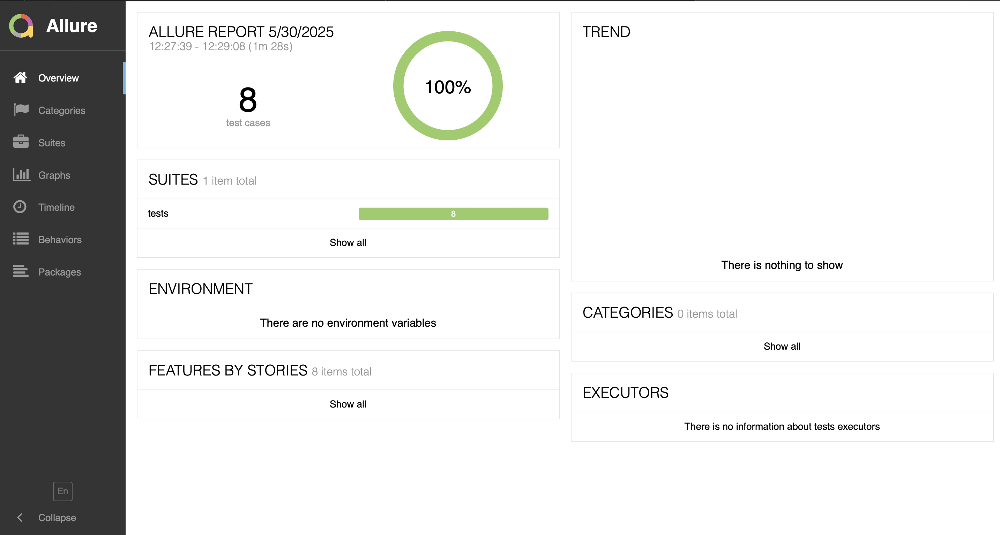
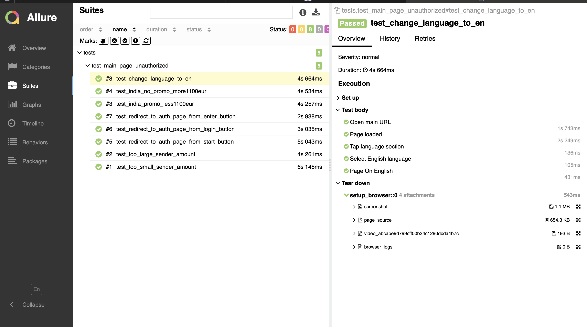
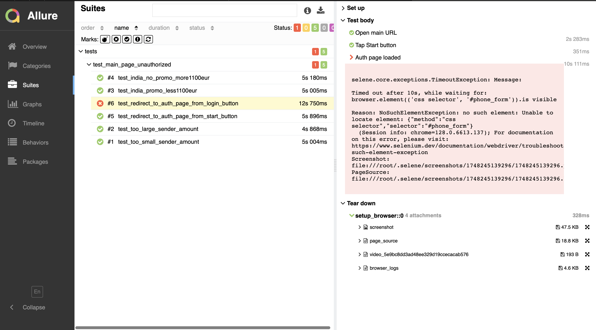
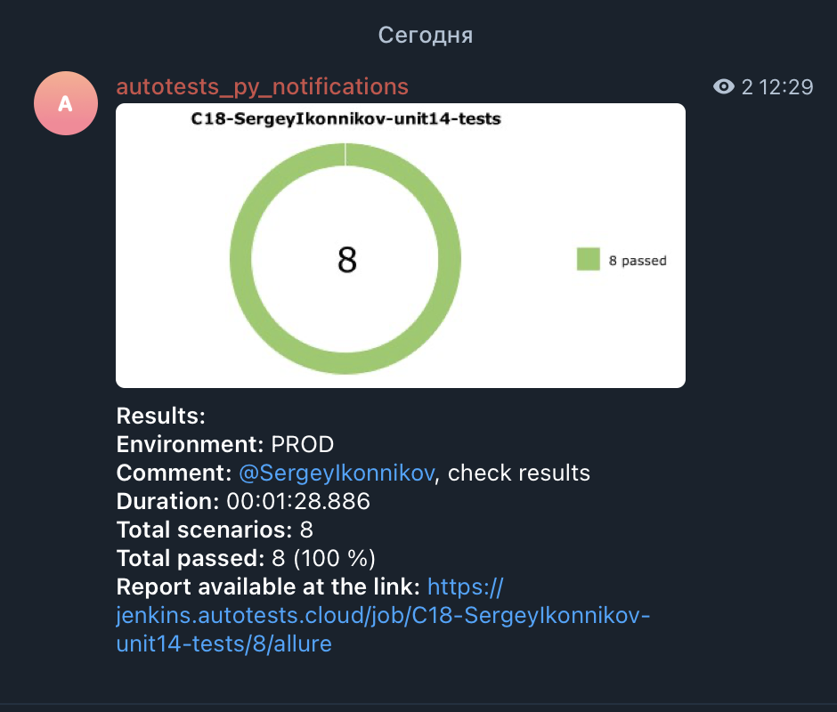

## Автотесты для сервиса денежных переводов [Profee](https://profee.com)
---
Реализованные проверки:
- Проверка ограничений на минимальную и максимальную суму перевода
- Проверка применения промокурса при соблюдении необходимых условий (позитивный и негативный сценарии)
- Переадресация на страницу логина с главной страницы (из нескольких мест)
- Негативный поиск результатов
- Смена локализации страницы на английский

---

Использованные технологии и инструменты:

>      

---
### Локальный запуск

Выполнить в консоли:

```
python -m venv .venv
source .venv/bin/activate
pip install -r requirements.txt
pytest profee_tests/tests
```
Генерация отчета после выполнения тестов:
```
allure serve tests/allure-results
```

### Удаленный запуск тестов в Jenkins

Ссылка на проект: https://jenkins.autotests.cloud/job/C18-SergeyIkonnikov-unit14-tests/

Запуск теста и получение отчета:
- нажать на 'Build with Parameters'. Значения оставляем по умолчанию, жмем на 'Build'
- После выполнения тестов отчет будет сгенерирован автоматически. Для его просмотра жмем на иконку allure



В разделе Suites доступен отчет о всех выполненных тестах. Для каждого теста описаны шаги его выполнения:



Если какой-то тест упадет, легко идентифицировать конкретный шаг, на котором возникла проблема. Также будут
полезны артефакты: скриншот, видеозапись теста, логи брауезра, page source (Доступны в разделе Tear Down)



---

В дополнение к ручному запуску Allure отчета, настроена отправка уведомления в Telegram:



